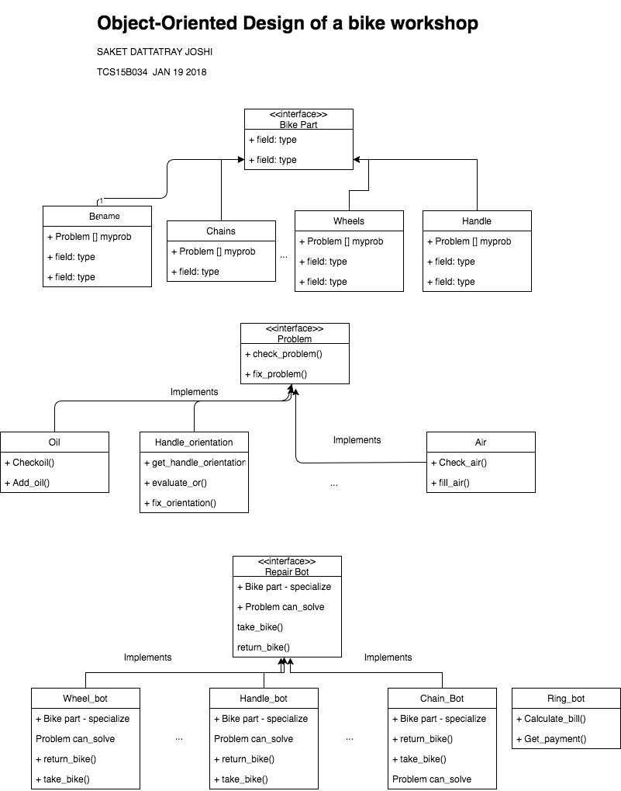

# Object Oriented Thinking Exercise - Bike repair workshop automation

Saket Joshi
TCSB034

### Solution

The model of final solution is [here](https://github.com/saketrule/Sem6/tree/master/OOAD/Bike_diagram_model.png)

### Problem:
Please recall the example of Bike-Workshop that I have presented in the previous OOAD class and gave it as assignment to you.

Consider you are automatic a mechanical workshop by robots. They accept a vehicle for service, take the service order, do the service and finally dispatch the vehicle. This is the broad scenario.

Now, you need to come up with "Object oriented thinking" on what API Bike should expose, what API workshop robots should expose, how they interact to achieve the service automatically.

The exercise now is,
1. List down various objects in the scenario (Objects may be physical or conceptual).
2. For each object indicate what is the API provided and for which functionality.

I would like to see 10 different object types, with each object having 2 API function calls (excepting constructor).

Each object type you detail, will fetch you 1 mark!
